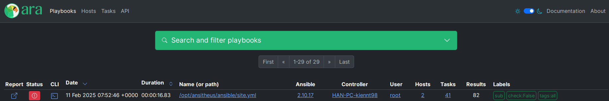
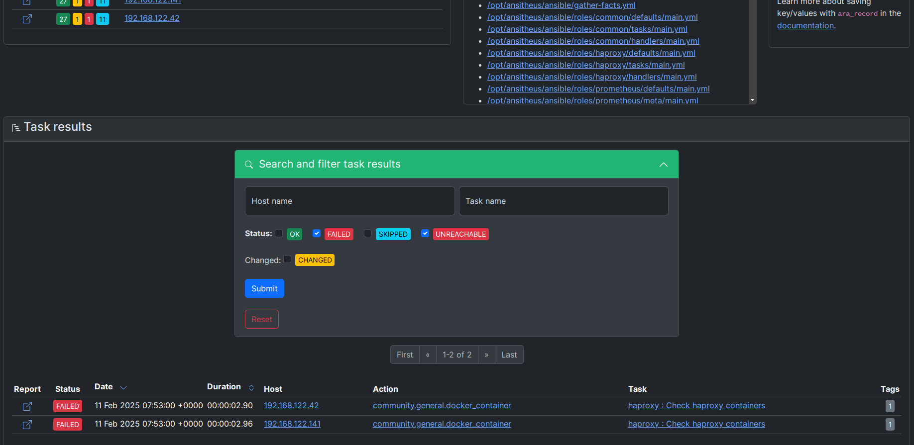

# Visualizing Ansitheus reports with ARA Records Ansible (ARA)

## 1. About ara

[ara](https://ara.recordsansible.org/) provides Ansible reporting by recording ``ansible`` and ``ansible-playbook`` commands regardless of how and where they run:

- from most Linux distributions and even on Mac OS (as long as ``python >= 3.8`` is available)
- from tools that run Ansible like ansible-(pull|test|runner|navigator), AWX & Automation Controller (Tower), Molecule and Semaphore
- from a terminal, a script or by hand
- from a laptop, desktop, server, virtual machine, container or execution environment
- from CI/CD platforms such as Jenkins, Rundeck and Zuul
- from git forges like GitHub, GitLab, Gitea & Forgejo

The recorded results are available via an included CLI, a REST API as well as a self-hosted, local-first web reporting interface.

<!-- https://github.com/ansible-community/ara/blob/master/doc/source/_static/demo.mp4 -->
https://github.com/ansible-community/ara/assets/1291204/4fbdf5f7-509c-46ea-beb0-726b43e1b985

## 2. Getting started

Started from version v2.2.0, Ansitheus already bundles ara on its Docker image. Checkout the [quickstart](./quickstart.md) for detail.

Firstly configure your ARA API server. Make sure it works properly. You can quickly deploy it using `docker-compose`:

```yaml
version: "3.8"

services:
  postgres:
    image: postgres:latest
    container_name: postgres
    environment:
      POSTGRES_USER: ara
      POSTGRES_PASSWORD: ara_password
      POSTGRES_DB: ara
    volumes:
      - postgres_data:/var/lib/postgresql/data
    restart: unless-stopped

  ara:
    image: recordsansible/ara-api:latest
    container_name: ara
    environment:
      - ARA_ALLOWED_HOSTS=["*"]
      - ARA_DATABASE_DRIVER=postgresql
      - ARA_DATABASE_USER=ara
      - ARA_DATABASE_PASSWORD=ara_password
      - ARA_DATABASE_HOST=postgres
      - ARA_DATABASE_NAME=ara
    ports:
      - "8000:8000"
    depends_on:
      - postgres
    restart: unless-stopped

volumes:
  postgres_data:
```

Now you can use visualize Ansitheus report using ARA (**don't forget to update `ARA_API.*` variables**).

```shell
docker run --name ansitheus --rm --network host \
    -e ARA_API_SERVER=http://localhost:8000 \
    -e ARA_API_CLIENT=http \
    -v /tmp/test/sub:/etc/ansitheus \
    -v /tmp/facts_cache:/tmp/facts_cache \
    kiennt26/ansitheus:v2.2.0 deploy --inventory /etc/ansitheus/inventory.ini
```

Result:




